[toc]

### Django 项目操作

##### 1、创建多个app

>django是MTV模式，即template（页面展现），modle（数据库表对象）,view（业务逻辑处理），在开发中发现，随着项目功能的增多，把所有的功能模块放在一个app肯定不切实际，也不符合网站开发的原则。

**语法：python manage.py startapp rbac （appname）**

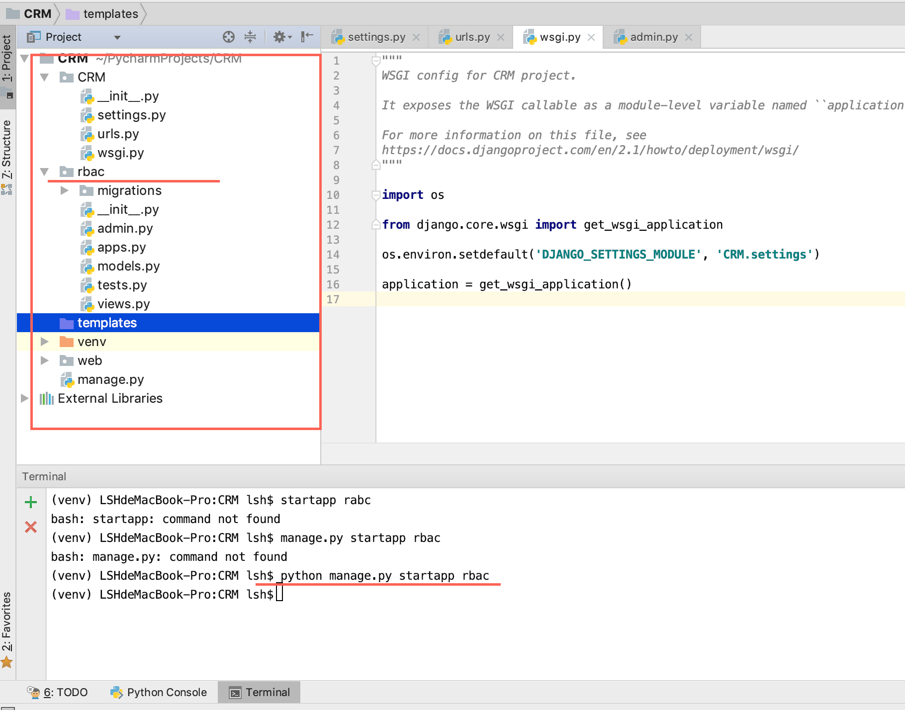

#####2、 在setting里面手动添加app
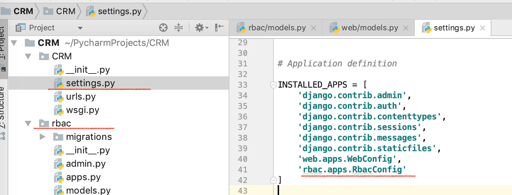

##### 3、数据库配置
    
	终端 mysql -uroot -p   进入私人操作，无密码，点击回车
	create database db_crm charset utf8;

	settings.py 设置替代原有的
	DATABASES = {
    'default': {
        'ENGINE': 'django.db.backends.mysql',
        'NAME':'db_bbs',
        'USER':'root',
        'PASSWORD':'',
        'HOST':'127.0.0.1',
        'PORT':''
    }
	}

注意：
import pymysql
pymysql.install_as_MySQLdb()

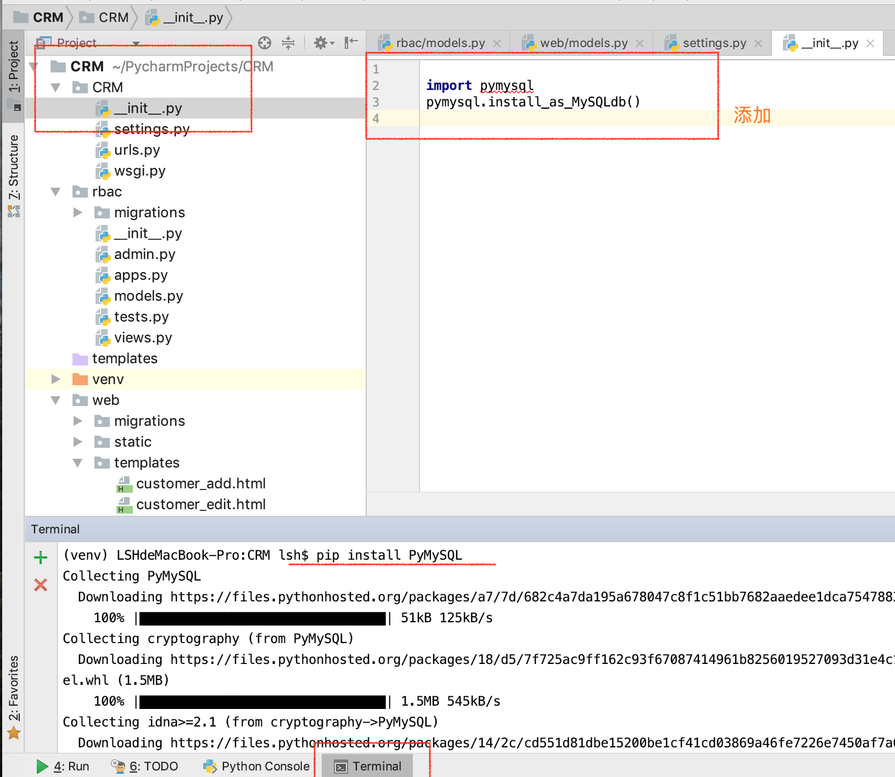

pip install PyMYSQL

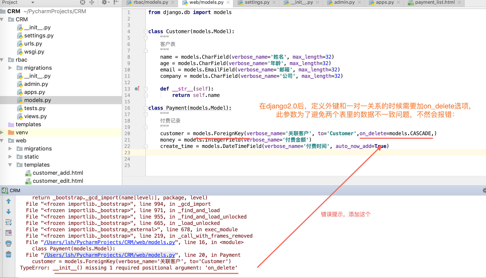

##### 4、创建表并数据迁移语法
**语法：python manage.py makemigrations**
**语法：python manage.py migrate**

##### 5、静态文件配置
setting.py里面配置

    # 静态文件胚子
	STATIC_URL = '/static/'

	STATIC_DIR =   (
    os.path.join(BASE_DIR, "static"),
	)

##### 6、模板引入静态文件

    前端引入

	在页面的较上处写：
	
	
	
	在 link script 等src 写 ：
	
	　
	
	

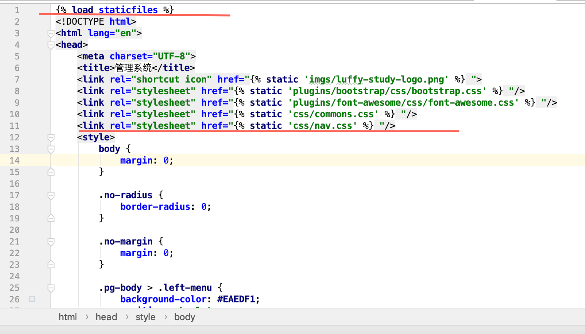

##### 7、创建超级用户
**语法：python manage.py createsuperuser**
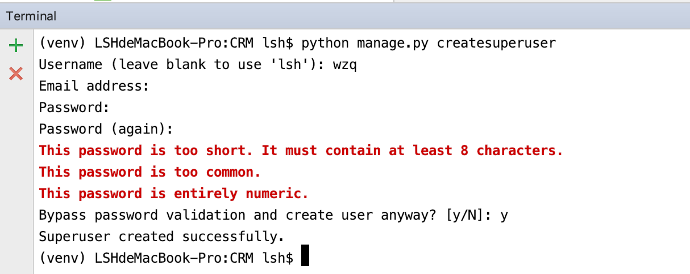

##### 8、后台admin注册

把rbac下的models.py里面的表注册到后台管理
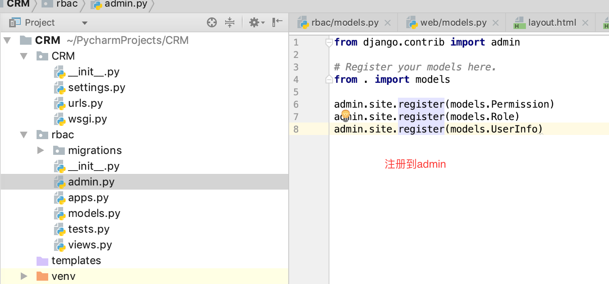

#####9、inclusion_tag的用法

>可以封装一些公共区域模板代码，继承复用

在app中创建templatetags模块(模块名只能是templatetags)

模板使用前要导入  

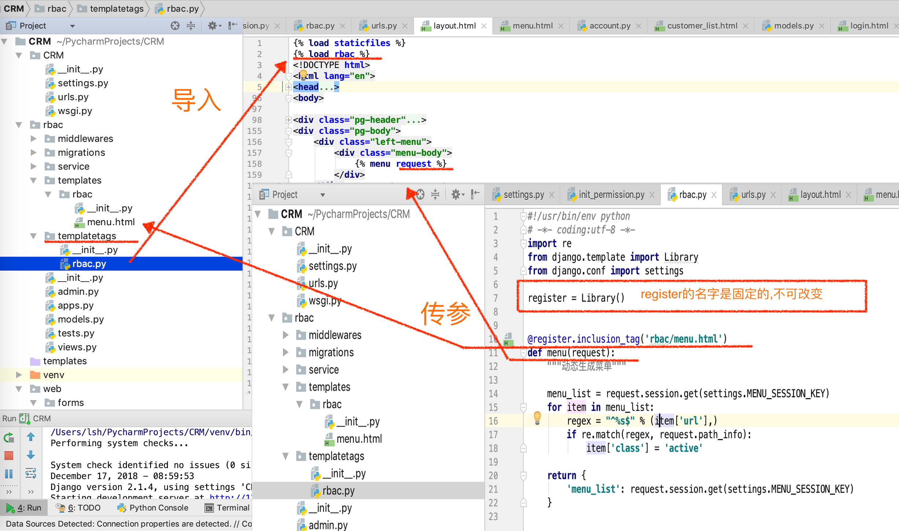

封装的模板

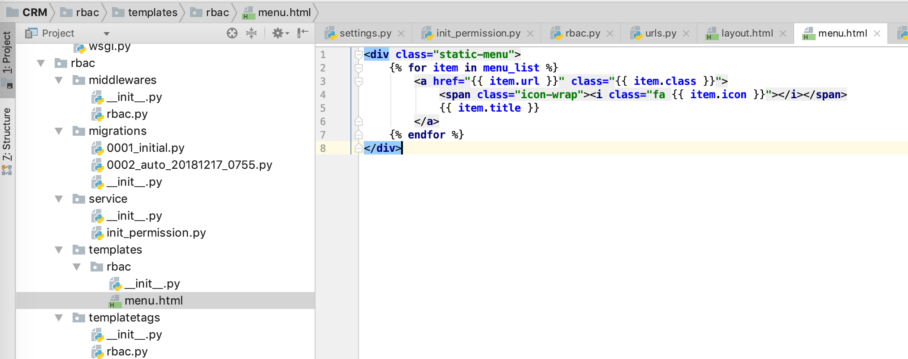

##### 10、自定义中间件
>中间件顾名思义，是介于request与response处理之间的一道处理过程，相对比较轻量级，并且在全局上改变django的输入与输出。因为改变的是全局，所以需要谨慎实用，用不好会影响到性能。

自定义的中间件要继承MiddlewareMixin
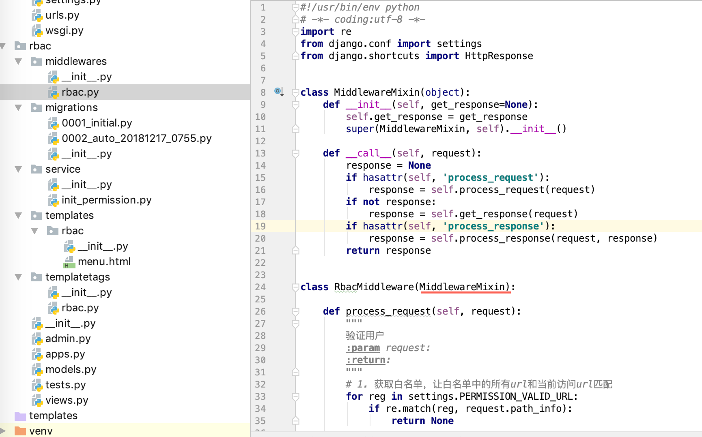

注册
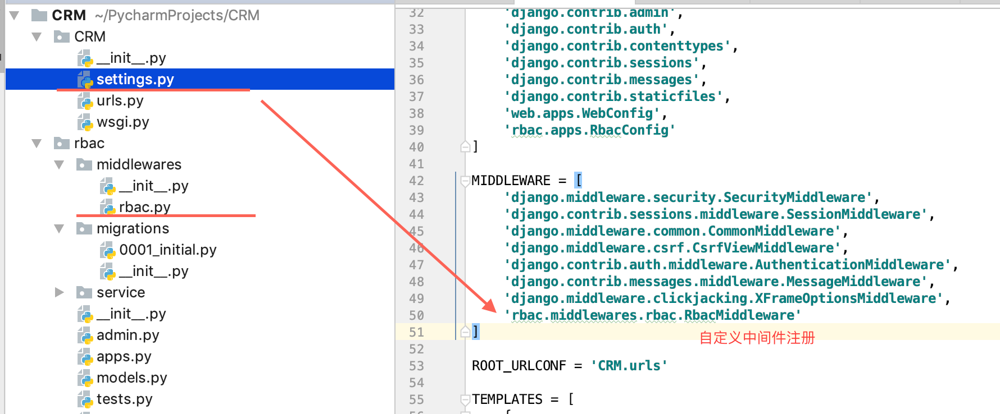

#####11、 ForeignKey

    # 相关参数
    (1)null
 
	如果为True，Django 将用NULL 来在数据库中存储空值。 默认值是 False.
	 
	(1)blank
	 
	如果为True，该字段允许不填。默认为False。
	要注意，这与 null 不同。null纯粹是数据库范畴的，而 blank 是数据验证范畴的。
	如果一个字段的blank=True，表单的验证将允许该字段是空值。如果字段的blank=False，该字段就是必填的。
	 
	(2)default
	 
	字段的默认值。可以是一个值或者可调用对象。如果可调用 ，每有新对象被创建它都会被调用。
	 
	(3)primary_key
	 
	如果为True，那么这个字段就是模型的主键。如果你没有指定任何一个字段的primary_key=True，
	Django 就会自动添加一个IntegerField字段做为主键，所以除非你想覆盖默认的主键行为，
	否则没必要设置任何一个字段的primary_key=True。
	 
	(4)unique
	 
	如果该值设置为 True, 这个数据字段的值在整张表中必须是唯一的
	 
	(5)choices
	由二元组组成的一个可迭代对象（例如，列表或元组），用来给字段提供选择项。 如果设置了choices ，默认的表单将是一个选择框而不是标准的文本框， 而且这个选择框的选项就是choices 中的选项。

**related_name**
当一张表的多个字段指向同一张表时，会出错。系统无法知道，通过另外一张表，访问XXX_set属性访问到的是哪个属性。这时，我们就需要为每个字段定义一个related_name属性，另外一张表访问这个表时，就会根据related_name的值来得到各个属性了。