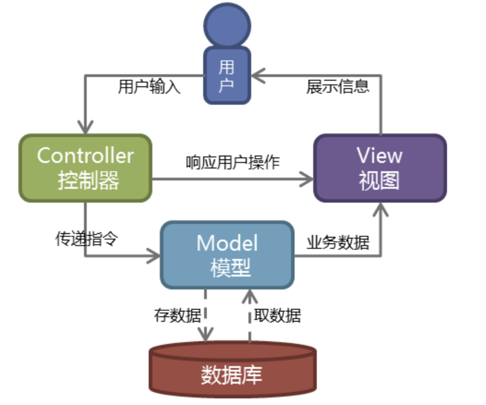
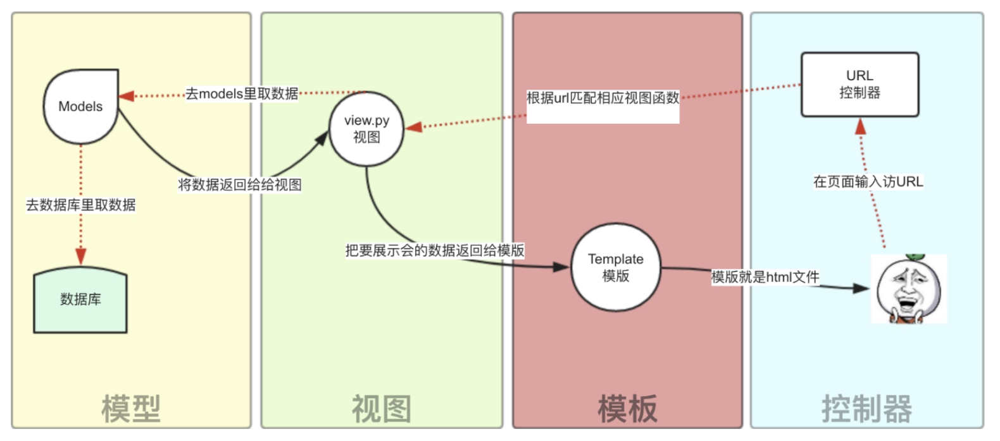
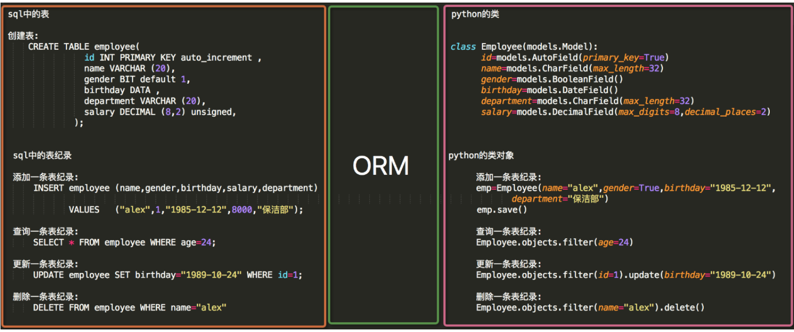
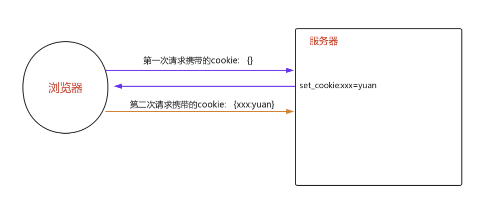
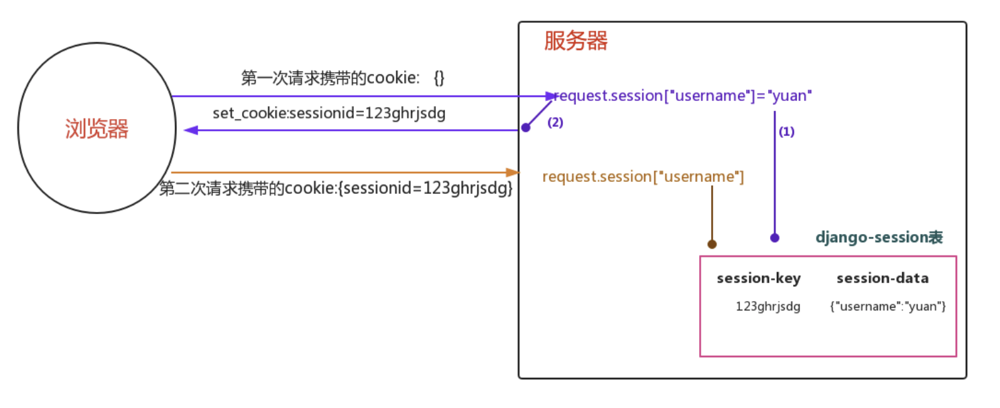

## Django的学习笔记

-------------------

[TOC]

### 1、Django的出现
#### django为什么会出现：
- 在 Web 早期阶段，开发者手动编写每个页面。更新网站要编辑 HTML;重新设计要重新制作每一个网页，而且一次只能改一个网页。随着网站体量的增大，这种方式立马变得繁琐、浪费时间，最终变得不切实际。
#### django目标：
- 使用 Django 能在极短的时间内构建全面动态的网站。Django 的主旨是让你集中精力在有趣的工作上，减轻重复劳作的痛苦。为此，它为常用的 Web 开发模式提供了高层抽象，为常见的编程任务提供了捷径，还为解 决问题提供了清晰的约定
#### Django 的核心
- **1. 表现与逻辑分离**
- **2. 避免重复**
- **3. 与 HTML 解耦**
- **4. XML 不好**
- **5. 不要求具备设计能力**
- **6. 透明处理空格**
- **7. 不重造一门编程语言**
- **8. 确保安全有保障**
- **9. 可扩展**

#### Django 是“为快节奏完美主义者而生的框架”。

### 2、Django的设计模式MTV
#### MVC设计模式
-		模型(M)是数据的表述。它不是真正的数据，而是数据的接口。使用模型从数据库中获取数据时， 无需知道底层数据库错综复杂的知识。模型通常还会为数据库提供一层抽象，这样同一个模型就能使 用不同的数据库。
-		视图(V)是你看到的界面。它是模型的表现层。在电脑中，视图是你在浏览器中看到的 Web 应用的页面，或者是桌面应用的 UI。视图还提供了收集用户输入的接口。
- 		控制器(C)控制模型和视图之间的信息流动。它通过程序逻辑判断通过模型从数据库中获取什么信 息，以及把什么信息传给视图。它还通过视图从用户那里收集信息，并且实现业务逻辑:变更视图， 或者通过模型修改数据，或者二者兼具。

#### MTV设计模式
-  		M 表示“模型”，即数据访问层。这一层包含所有与数据相关的功能:访问数据的方式、验证数据的方 式、数据的行为、数据之间的关系。
-		T 表示“模板”，即表现层。这一层包含表现相关的决策:在网页或其他文档类型中如何显示某个东 西。
- 		V 表示“视图”，即业务逻辑层。这一层包含访问模型和选择合适模板的逻辑。你可以把视图看做模型 和模板之间的桥梁。
核心内容

### 3、URL 路由层
#### URL 配置以及 Django 背后的一个重要哲学:松耦合。
1、简单来说，松耦合是一 种软件开发方式，其价值在于让组件可以互换。如果两部分代码之间是松耦合的，那么改动其中一部分对另 一部分的影响很小，甚至没有影响。
在 Django Web 应用中，URL定义与所调用的视图函数之间 是松耦合的，即某个功能使用哪个URL与视图函数的实现本身放在两个地方。

- 静态的URL

    urlpatterns = [
        url(r'^admin/', include(admin.site.urls)),
        url(r'^hello/$', views.hello_world),]

- 动态的URL

     urlpatterns = [
        url(r'^admin/', include(admin.site.urls)),
        url(r'^time/$', current_datetime),
        url(r'^time/plus/(\d{1,2})/$', hours_ahead),]

>**Django 的核心哲学之一是，URL应该美观**。
- /	time/plus/3/这样的URL更加简洁明了，更加易于阅读，更加易于大声读出来......而且比使用查询字符串的版本美观得多。
- **美观的 URL 是高质量 Web 应用的一个特色。**
- Django 的 URL 配置系统鼓励使用美观的 URL，而且为此提供了简易的方式。
#### 有名分组

    在Python 正则表达式中，命名正则表达式组的语法是(?P<name>pattern)，其中name 是组的名称，pattern 是要匹配的模式.
    urlpatterns = [
      urlpatterns = [
	re_path(r'^articles/2003/$', views.special_case_2003),
	re_path(r'^articles/(?P<year>[0-9]{4})/$', views.year_archive),
	re_path(r'^articles/(?P<year>[0-9]{4})/(?P<month>[0-9]{2})/$', views.month_archive),
	re_path(r'^articles/(?P<year>[0-9]{4})/(?P<month>[0-9]{2})/(?P<day>[0-9]{2})/$', views.article_detail),
	],

>注意
• 若想捕获 URL 中的值，把值放在括号里。
• 无需使用前导斜线，每个 URL 本身就有。例如，是 ^reviews，而非 ^/reviews。
• 每个正则表达式字符串前面的 'r' 是可选的，但是建议加上。它的作用是告诉 Python，那是“原始”字符串，里面的一切内容都不应该转义。

#### 引入其他 URL 配置  include

这里的正则表达式没有 $(匹配字符串末尾的符号)，但是末尾有斜线。Django 遇到 include() 时， 会把截至那一位置匹配的 URL 截断，把余下的字符串传给引入它的 URL 配置，做进一步处理。此外，还可以使用 url() 引入额外的 URL 模式。

    1、urlpatterns = [
        url(r'^$', main_views.homepage),
        url(r'^help/', include('apps.help.urls')),
        url(r'^credit/', include(extra_patterns)),
	]

	2、extra_patterns = [
	url(r'^reports/(?P<id>[0-9]+)/$', credit_views.report),
    ]

>例如：/credit/reports/ 这个 URL 由 2下面的credit.views.report() 视图处理。

#### 反向解析 URL
1、在 Django 项目中经常需要获取 URL 的最终形式，这么做是为了在生成的内容中嵌入 URL(视图和静态资源的 URL、呈现给用户的 URL，等等)，或者在服务器端处理导航流程(重定向等)。 

此时，一定不能硬编URL(费时、不可伸缩，而且容易出错)，或者参照 URL 配置创造一种生成 URL 的机制，因为这样容易导致线上 URL 失效。也就是说，我们需要一种不自我重复的机制。

2、这种机制的一个优点是，改进 URL 设计之后无需在项目的源码中大范围搜索，替换掉过期的 URL。目前， 我们能获取的信息有负责处理 URL 的视图标识(即视图名称)，以及查找正确 URL 所需的视图参数类型 (位置参数或关键字参数)和值。

- **Django 在不同的层中提供了执行 URL 反转所需的工具:**
		1、在模板中，使用 url 模板标签。
		2、在 Python 代码中，使用 django.core.urlresolvers.reverse() 函数。
		3、在处理 Django 模型实例 URL 相关的高层代码中，使用 get_absolute_url() 方法。

#### 名称空间

命名空间（英语：Namespace）是表示标识符的可见范围。一个标识符可在多个命名空间中定义，它在不同命名空间中的含义是互不相干的。这样，在一个新的命名空间中可定义任何标识符，它们不会与任何已有的标识符发生冲突，因为已有的定义都处于其它命名空间中。 由于name没有作用域，Django在反解URL时，会在项目全局顺序搜索，当查找到第一个name指定URL时，立即返回 我们在开发项目时，会经常使用name属性反解出URL，当不小心在不同的app的urls中定义相同的name时，可能会导致URL反解错误，为了避免这种事情发生，引入了命名空间。

    urlpatterns = [
	re_path(r'^admin/', admin.site.urls),
	re_path(r'^app01/', include("app01.urls",namespace="app01")),
	re_path(r'^app02/', include("app02.urls",namespace="app02")),
	]

### 4、Django 模板
#### 什么是模板
Django 模板是一些文本字符串，作用是把文档的表现与数据区分开。模板定义一些占位符和基本的逻辑(模板标签)，规定如何显示文档。通常，模板用于生成 HTML，不过 Django 模板可以生成任何基于文本的格式。

    <html>
    <head>
      <title>标题</title>
    </head>
	<body>
	<h1>欢迎</h1>
        
亲爱的 {{ person_name }},

        
谢谢你来到我们的 {{ company }}参加年会.  我们公司成立于{{
    create_date|date:"Y-m-d" }}.

        
接下来我宣布一下今天的活动流程:

        <ul>
            
            <li>{{ item }}</li>
        </ul>
        
        
恭喜你获得了奖品.

        
        

            恭喜你获得了纪念品。
		

		
        
谢谢大家参加, {{ company }}

    </body>
	</html>

这个模板的大部分内容是 HTML，内含一些变量和模板标签。下面详细说明。

- {{ person_name }}
	意思是“把指定变量的值插入这里”
- ) ，
	if 标签的作用是编写逻辑判断语句。

- )
	for 标签的作用与 Python 中的 for 语句很像，用于迭代序列中的各个元素。
- {{create_date|date: "Y-m-d" }}
	我们把create_date变量传给 date 过滤器，并且为date过滤器指定 "Y-m-d" 参数。date 过滤器使用参数指定的格式格式化日期。过滤器使用管道符号(|)依附，类似于 Unix 管道。
#### 模板语言
##### 
(DTL：Django Template Language)
创建模板，Template 类在 django.template 模块中，HTML文件都在此文件下创建。
##### 1、模板标签
**if 标签**

    
    
Welcome to the weekend!

    
    
Get back to work.

    
		if 标签还可以有一个或多个  子句:

 支持使用 and、or 或 not 测试多个变量，或者取反指定的变量
>在同一个标签中可以同时使用 and 和 or，此时,and 的**优先级**比 or 高。

**for标签**
 标签用于迭代序列中的各个元素。与 Python 的 for 语句一样，句法是 for X in Y，其中 Y 是要迭 代的序列，X 是单次循环中使用的变量。每次迭代时，模板系统会渲染  和  之间的内 容。

    
    {{ key }}: {{ value }}
    

 for 标签支持一个可选的  子句。
 

    
    
{{ athlete.name }}

    
    
There are no athletes. Only computer programmers.

    

- for循环下面有个名为 forloop 的模板变量。
	- forloop.counter的值是一个整数，表示循环的次数。这个属性的值从1开始。
	- forloop.counter 0与forloop.counter类似，不过是从零开始的。第一次循环时，其值为0。
	- forloop.revcounter的值是一个整数，表示循环中剩余的元素数量。第一次循环时，for- loop.revcounter 的值是序列中要遍历的元素总数。最后一次循环时，forloop.revcounter 的值为 1。
	- forloop.revcounter0与forloop.revcounter类似，不过索引是基于零的。第一次循环时，for- loop.revcounter0 的值是序列中元素数量减去一。最后一次循环时，forloop.revcounter0 的值为 0。
	- forloop.first是个布尔值，第一次循环时为True。
	- forloop.last是个布尔值，最后一次循环时为True。

**注释**
与 HTML 和 Python 一样，Django 模板语言支持注释。
注释使用 {# #} 标明:

#####2、过滤器
**举例：**

**default**
如果一个变量是false或者为空，使用给定的默认值。否则，使用变量的值。例如：

    {{ value|default:"nothing" }}

**length**
返回值的长度。它对字符串和列表都起作用。例如：

    {{ value|length }}

如果 value 是 ['a', 'b', 'c', 'd']，那么输出是 4。
**date**
 value=datetime.datetime.now() 

    {{ value|date:"Y-m-d" }}

显示数据为：年 - 月 -日
##### 3、模板继承 (extend)
Django模版引擎中最强大也是最复杂的部分就是模版继承了。模版继承可以让您创建一个基本的“骨架”模版，它包含您站点中的全部元素，并且可以定义能够被子模版覆盖的 blocks 。
通过从下面这个例子开始，可以容易的理解模版继承：

    <!DOCTYPE html>
	<html lang="en">
	<head>
    <link rel="stylesheet" href="style.css" />
    <title>My amazing site</title>
	</head>
	<body>
	
    

        
        <ul>
            <li><a href="/">Home</a></li>
            <li><a href="/blog/">Blog</a></li>
        </ul>
        
    

    

        
    

    
	</body>
	</html>

这个模版，我们把它叫作 base.html， 它定义了一个可以用于两列排版页面的简单HTML骨架。“子模版”的工作是用它们的内容填充空的blocks。
在这个例子中， block 标签定义了三个可以被子模版内容填充的block。 block 告诉模版引擎： 子模版可能会覆盖掉模版中的这些位置。
子模版可能看起来是这样的：

    

	My amazing blog

	
	
	    <h2>{{ entry.title }}</h2>
	    
{{ entry.body }}

	
	

extends 标签是这里的关键。它告诉模版引擎，这个模版“继承”了另一个模版。当模版系统处理这个模版时，首先，它将定位父模版——在此例中，就是“base.html”。
那时，模版引擎将注意到 base.html 中的三个 block 标签，并用子模版中的内容来替换这些block。根据 blog_entries 的值，输出可能看起来是这样的：

    <!DOCTYPE html>
	<html lang="en">
	<head>
	    <link rel="stylesheet" href="style.css" />
	    <title>My amazing blog</title>
	</head>
	
	<body>
	    

	        <ul>
	            <li><a href="/">Home</a></li>
	            <li><a href="/blog/">Blog</a></li>
	        </ul>
	    

	
	    

	        <h2>Entry one</h2>
	        
This is my first entry.

	
	        <h2>Entry two</h2>
	        
This is my second entry.

	    

	</body>
	</html>

请注意，子模版并没有定义 sidebar block，所以系统使用了父模版中的值。父模版的  标签中的内容总是被用作备选内容（fallback）。
这种方式使代码得到最大程度的复用，并且使得添加内容到共享的内容区域更加简单，例如，部分范围内的导航。
这里是使用继承的一些提示：
- 如果你在模版中使用  标签，它必须是模版中的第一个标签。其他的任何情况下，模版继承都将无法工作。
- 在base模版中设置越多的  标签越好。请记住，子模版不必定义全部父模版中的blocks，所以，你可以在大多数blocks中填充合理的默认内容，然后，只定义你需要的那一个。多一点钩子总比少一点好。
- 如果你发现你自己在大量的模版中复制内容，那可能意味着你应该把内容移动到父模版中的一个  中。
- 为了更好的可读性，你也可以给你的 标签一个 名字 。例如：
	
    
	...
	

- 不能在一个模版中定义多个相同名字的 block 标签。 

### 5、连接数据库（ORM系统）
**ORM：Object Relational Mapping    (关系对象映射)**

>MVC或者MVC框架中包括一个重要的部分，就是ORM，它实现了数据模型与数据库的解耦，即数据模型的设计不需要依赖于特定的数据库，通过简单的配置就可以轻松更换数据库，这极大的减轻了开发人员的工作量，不需要面对因数据库变更而导致的无效劳动

#### 配置数据库
看一下创建应用程序时在 settings.py 文件中添 加的初始配置:

      settings.py 设置替代原有的
		DATABASES = {
    'default': {
        'ENGINE': 'django.db.backends.mysql',   # 数据库名称
        'NAME':'db_news',        # 需要提前在数据库创建
        'USER':'root',           
        'PASSWORD':'',
        'HOST':'127.0.0.1',       
        'PORT':'',}
	}

**注意1：**
>NAME即数据库的名字，在mysql连接前该数据库必须已经创建，而上面的sqlite数据库下的db.sqlite3则是项目自动创建 USER和PASSWORD分别是数据库的用户名和密码。设置完后，再启动我们的Django项目前，我们需要激活我们的mysql。

>然后，启动项目，会报错：no module named MySQLdb 。这是因为django默认你导入的驱动是MySQLdb，可是MySQLdb 对于py3有很大问题，所以我们需要的驱动是PyMySQL 所以，我们只需要找到项目名文件下的__init__,在里面写入：

    import pymysql
	pymysql.install_as_MySQLdb()

>最后通过两条数据库迁移命令即可在指定的数据库中创建表 ：

    python manage.py makemigrations
	python manage.py migrate

**注意2:**
>确保配置文件中的INSTALLED_APPS中写入我们创建的app名称

	INSTALLED_APPS = [
    'django.contrib.admin',
    'django.contrib.auth',
    'django.contrib.contenttypes',
    'django.contrib.sessions',
    'django.contrib.messages',
    'django.contrib.staticfiles',
    "app"
	]

#### 创建模型
在app下的models.py中创建模型：

    from django.db import models
	# Create your models here.
	
	class Book(models.Model):
	     id=models.AutoField(primary_key=True)
	     title=models.CharField(max_length=32)
	     state=models.BooleanField()
	     pub_date=models.DateField()
	     price=models.DecimalField(max_digits=8,decimal_places=2)
	     publish=models.CharField(max_length=32)

**添加表纪录**

	  book_obj=Book.objects.create(title="python葵花宝典",state=True,price=100,publish="苹果出版社",pub_date="2012-12-12")
	  或
	book_obj=Book(title="python葵花宝典",state=True,price=100,publish="苹果出版社",pub_date="2012-12-12")
	book_obj.save()

**查询表纪录**
><1> all():                  查询所有结果  

><2> filter(**kwargs):       它包含了与所给筛选条件相匹配的对象

><3> get(**kwargs):          返回与所给筛选条件相匹配的对象，返回结果有且只有一个，如果符合筛选条件的对象超过一个或者没有都会抛出错误。
  
><4> exclude(**kwargs):      它包含了与所给筛选条件不匹配的对象
 
><5> order_by(*field):       对查询结果排序
  
><6> reverse():              对查询结果反向排序
  
><7> count():                返回数据库中匹配查询(QuerySet)的对象数量。
  
><8> first():                返回第一条记录
  
><9> last():                返回最后一条记录
  
><10> exists():              如果QuerySet包含数据，就返回True，否则返回False
 
><11> values(*field):        返回一个ValueQuerySet——一个特殊的QuerySet，运行后得到的并不是一系列model的实例化对象，而是一个可迭代的字典序列

><12> values_list(*field):   它与values()非常相似，它返回的是一个元组序列，values返回的是一个字典序列
 
><13> distinct():            从返回结果中剔除重复纪录

##### 基于双下划线的跨表查询 
Django 还提供了一种直观而高效的方式在查询(lookups)中表示关联关系，它能自动确认 SQL JOIN 联系。要做跨关系查询，就使用两个下划线来链接模型(model)间关联字段的名称，直到最终链接到你想要的model 为止。

    查询苹果出版社出版过的所有书籍的名字与价格(一对多)

    # 正向查询 按字段:publish

    queryResult=Book.objects.filter(publish__name="苹果出版社").values_list("title","price")

    # 反向查询 按表名:book

    queryResult=Publish.objects　.filter(name="苹果出版社").values_list("book__title","book__price")

##### 多对多查询　　

    # 正向查询 按字段:authors:
    queryResult=Book.objects.filter(authors__name="yuan").values_list("title")　　　　　　　　　
    # 反向查询 按表名:book
    queryResult=Author.objects.filter(name="yuan").values_list("book__title","book__price")

##### 聚合查询与分组查询
　　　　　　　　　　　　　
**聚合**
aggregate(*args, **kwargs)

    # 计算所有图书的平均价格
    >>> from django.db.models import Avg
    >>> Book.objects.all().aggregate(Avg('price'))

	>>> Book.objects.aggregate(average_price=Avg('price'))

**分组**

    # sql语句:
	select dep.name,Count(*) from emp left join dep on emp.dep_id=dep.id group by dep.id
	#在个人职务表和部门表连表查询，通过部门id分类

	# ORM:
	dep.objetcs.values("id").annotate(c=Count("emp")).values("name","c")

##### F查询与Q查询
**F查询**
    # 查询评论数大于收藏数的书籍
	from django.db.models import F
	Book.objects.filter(commnetNum__lt=F('keepNum'))
	
	# 查询评论数大于收藏数2倍的书籍
    Book.objects.filter(commnetNum__lt=F('keepNum')*2)
    
	# 修改操作也可以使用F函数,比如将每一本书的价格提高30元：
	Book.objects.all().update(price=F("price")+30)　

**Q查询**

如果你需要执行更复杂的查询（例如OR 语句），你可以使用Q 对象。

    from django.db.models import Q
	Q(title__startswith='Py')
	
	# Q 对象可以使用& 和| 操作符组合起来。当一个操作符在两个Q 对象上使用时，它产生一个新的Q 对象。
	bookList=Book.objects.filter(Q(authors__name="yuan")|Q(authors__name="egon"))
	# 等同于下面的SQL WHERE 子句：
	WHERE name ="yuan" OR name ="egon"

你可以组合& 和|  操作符以及使用括号进行分组来编写任意复杂的Q 对象。同时，Q 对象可以使用~ 操作符取反，这允许组合正常的查询和取反(NOT) 查询：

    bookList=Book.objects.filter(Q(authors__name="yuan") & ~Q(publishDate__year=2017)).values_list("title")
 
 查询函数可以混合使用Q 对象和关键字参数。所有提供给查询函数的参数（关键字参数或Q 对象）都将"AND”在一起。但是，如果出现Q 对象，它必须位于所有关键字参数的前面。例如：
 

    bookList=Book.objects.filter(Q(publishDate__year=2016) | Q(publishDate__year=2017),title__icontains="python")

### 6、会话 cookie 与 session

#### Cookie概述
Cookie翻译成中文是小甜点，小饼干的意思。在HTTP中它表示服务器送给客户端浏览器的小甜点。其实Cookie是key-value结构，类似于一个python中的字典。随着服务器端的响应发送给客户端浏览器。然后客户端浏览器会把Cookie保存起来，当下一次再访问服务器时把Cookie再发送给服务器。 Cookie是由服务器创建，然后通过响应发送给客户端的一个键值对。客户端会保存Cookie，并会标注出Cookie的来源（哪个服务器的Cookie）。当客户端向服务器发出请求时会把所有这个服务器Cookie包含在请求中发送给服务器，这样服务器就可以识别客户端了！

**Cookie规范**
- Cookie大小上限为4KB；
	一个服务器最多在客户端浏览器上保存20个Cookie；
	一个浏览器最多保存300个Cookie；

上面的数据只是HTTP的Cookie规范，但在浏览器大战的今天，一些浏览器为了打败对手，为了展现自己的能力起见，可能对Cookie规范“扩展”了一些，例如每个Cookie的大小为8KB，最多可保存500个Cookie等！但也不会出现把你硬盘占满的可能！
>注意，不同浏览器之间是不共享Cookie的。也就是说在你使用IE访问服务器时，服务器会把Cookie发给IE，然后由IE保存起来，当你在使用FireFox访问服务器时，不可能把IE保存的Cookie发送给服务器。

**Cookie与HTTP头**
Cookie是通过HTTP请求和响应头在客户端和服务器端传递的：

- Cookie：请求头，客户端发送给服务器端；
格式：Cookie: a=A; b=B; c=C。即多个Cookie用分号离开； Set-Cookie：响应头，服务器端发送给客户端；一个Cookie对象一个Set-Cookie： Set-Cookie: a=A Set-Cookie: b=B Set-Cookie: c=C

**Cookie的覆盖**
- 如果服务器端发送重复的Cookie那么会覆盖原有的Cookie，例如客户端的第一个请求服务器端发送的Cookie是：Set-Cookie: a=A；第二请求服务器端发送的是：Set-Cookie: a=AA，那么客户端只留下一个Cookie，即：a=AA。

**django中的cookie语法**

    # 设置cookie：
    rep = HttpResponse(...) 或 rep ＝ render(request, ...) 或 rep ＝ redirect()  
	rep.set_cookie(key,value,...)
	rep.set_signed_cookie(key,value,salt='加密盐',...)
	
	# 获取cookie：
	request.COOKIES
	
	# 删除cookie：
	response.delete_cookie("cookie_key",path="/",domain=name)

#### session概述

Session是服务器端技术，利用这个技术，服务器在运行时可以 为每一个用户的浏览器创建一个其独享的session对象，由于 session为用户浏览器独享，所以用户在访问服务器的web资源时 ，可以把各自的数据放在各自的session中，当用户再去访问该服务器中的其它web资源时，其它web资源再从用户各自的session中 取出数据为用户服务。

**django中session语法**

    1、设置Sessions值
          request.session['session_name'] ="admin"
	2、获取Sessions值
          session_name = request.session["session_name"]
	3、删除Sessions值
          del request.session["session_name"]
	4、flush()
     删除当前的会话数据并删除会话的Cookie。
     这用于确保前面的会话数据不可以再次被用户的浏览器访问
	5、get(key, default=None)
	  fav_color = request.session.get('fav_color', 'red')  
	6、pop(key)
	  fav_color = request.session.pop('fav_color')  
	7、keys()
	8、items()  
	9、setdefault()  
	10 用户session的随机字符串
        request.session.session_key

        # 将所有Session失效日期小于当前日期的数据删除
        request.session.clear_expired()

        # 检查 用户session的随机字符串 在数据库中是否
        request.session.exists("session_key")

        # 删除当前用户的所有Session数据
        request.session.delete("session_key")

        request.session.set_expiry(value)
            * 如果value是个整数，session会在些秒数后失效。
            * 如果value是个datatime或timedelta，session就会在这个时间后失效。
            * 如果value是0,用户关闭浏览器session就会失效。
            * 如果value是None,session会依赖全局session失效策略。

**session配置**

    Django默认支持Session，并且默认是将Session数据存储在数据库中，即：django_session 表中。

	a. 配置 settings.py

    SESSION_ENGINE = 'django.contrib.sessions.backends.db'   # 引擎（默认）

    SESSION_COOKIE_NAME ＝ "sessionid"                       # Session的cookie保存在浏览器上时的key，即：sessionid＝随机字符串（默认）
    SESSION_COOKIE_PATH ＝ "/"                               # Session的cookie保存的路径（默认）
    SESSION_COOKIE_DOMAIN = None                             # Session的cookie保存的域名（默认）
    SESSION_COOKIE_SECURE = False                            # 是否Https传输cookie（默认）
    SESSION_COOKIE_HTTPONLY = True                           # 是否Session的cookie只支持http传输（默认）
    SESSION_COOKIE_AGE = 1209600                             # Session的cookie失效日期（2周）（默认）
    SESSION_EXPIRE_AT_BROWSER_CLOSE = False                  # 是否关闭浏览器使得Session过期（默认）
    SESSION_SAVE_EVERY_REQUEST = False                       # 是否每次请求都保存Session，默认修改之后才保存（默认）