[TOC]

## HTTP 学习
### 网络基础
>HTTP协议：Hyper Text Transfer Protocol（超文本传输协议）
>**TCP/IP:Transmission Control Protocol/Internet Protocol**(传输控制协议/因特网互联协议)

>万维网：WWW:World Wide Web 

>Web框架：Web framework

应用层
>FTP：File Fransfer Protocol （ 文件传输协议 ）
>DNS：Domain Name System (域名系统）

传输层
>TCP:Transmission Control Protocol（传输控制协议）
>UDP:User Data Protocol (用户数据报协议)

链路层
>NIC:Network Interface Card (网络适配器，即网卡)

**TCP/IP 通信传输过程**
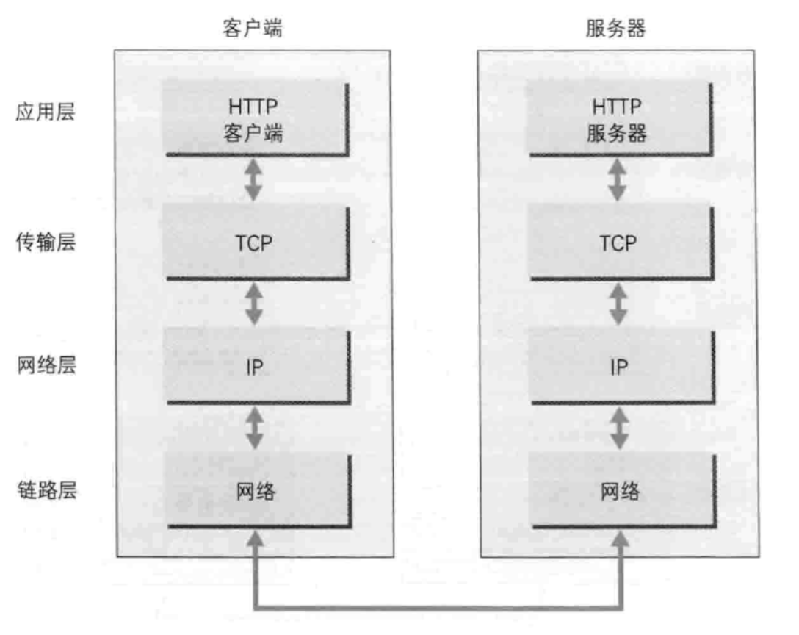
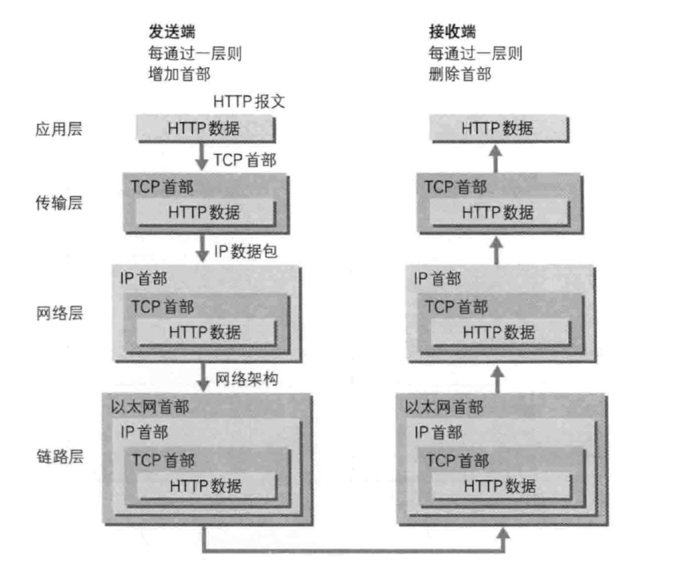

> 发送端在层与层之间传输数据时，每经过一层必定会被打上一个该层所属的首部信息。反之，接收端在层与层传输数据时，每经过一层会把对应的首部消去。

这种把数据信息包装起来的做法叫**封装（encapsulate）**

**IP协议**
IP: Internet Protocl （位于网络层）
>这是说的’IP’不是'IP地址'，而是一中协议的名称。

IP协议的作用是把各种数据包传给对方。
依托两个重要条件：

>IP地址 和 MAC地址（IP地址可变化，MAC 地址基本不会更改）

MAC：Media Access Control Address  

使用ARP协议 凭借MAC地址进行通信
ARP协议：Address Resolution Protocol
>IP间的通信依赖MAC地址。在网络上，通信的双方在同一局域网（LAN）内的情况是很少的，通常是经过多台计算机和网络设备中转来连接对方。
>ARP是一种用于解析地址的协议，根据通信方的IP地址就可以反查出对方对应的MAC地址。

**确保可靠性的TCP协议**
TCP位于传输层，采用三次握手策略。
>用TCP 协议把数据包发送出去后，TCP不会对传送后的情况置之不理，它一定会向对方确认是否成功到达。

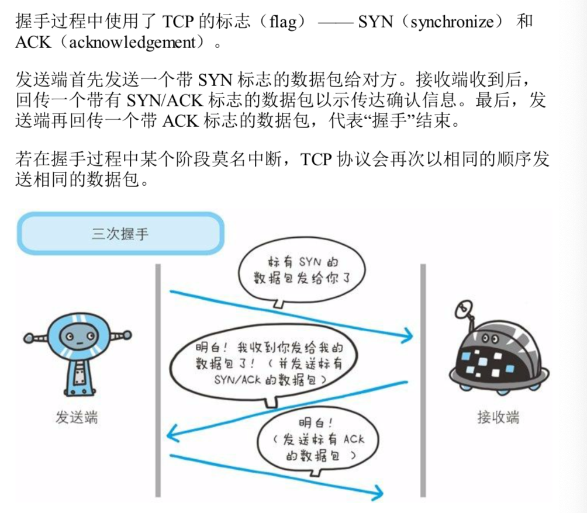

DNS：Domain Name System (域名系统)
>DNS 服务是和HTTP 协议一样位于应用层的协议，它提供域名到IP 地址之间的解析服务。

**各种协议与HTTP协议的关系**

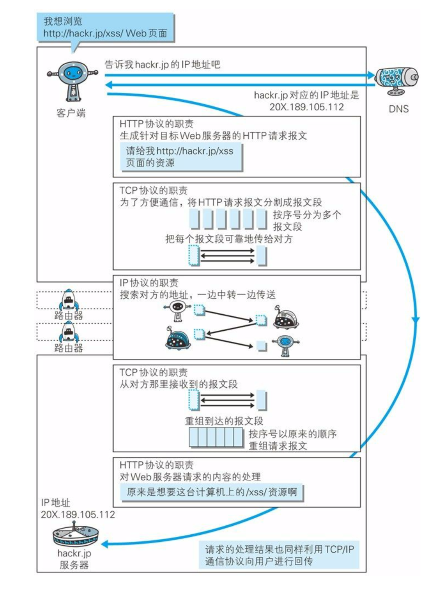

URL：UniForm Resource Locator （统一资源定位符）
URI：UniForm Resource Identifier (统一资源标识符)

URI 的格式

### 简单的HTTP协议

http协议特点
- 基于TCP/IP
>计算机与网络设备要相互通信,双方就必须基于相同的方法。比如,如何探测到通信目标、由哪一边先发起通信、使用哪种语言进行通 信、怎样结束通信等规则都需要事先确定。不同的硬件、操作系统之间 的通信,所有的这一切都需要一种规则。而我们就把这种规则称为协议(protocol)。协议中存在各式各样的内容。从电缆的规格到IP地址的选定方法、 寻找异地用户的方法、双方建立通信的顺序,以及Web页面显示需要 处理的步骤,等等。像这样把与互联网相关联的协议集合起来总称为TCP/IP。而http协议是基于TCP/IP协议之上的应用层协议。

- 基于请求－响应模式
>HTTP协议规定,请求从客户端发出,最后服务器端响应该请求并 返回。换句话说,肯定是先从客户端开始建立通信的,服务器端在没有 接收到请求之前不会发送响应

- 无状态保存
>HTTP是一种不保存状态,即无状态(stateless)协议。HTTP协议 自身不对请求和响应之间的通信状态进行保存。也就是说在HTTP这个 级别,协议对于发送过的请求或响应都不做持久化处理。

- 无连接
>无连接的含义是限制每次连接只处理一个请求。服务器处理完客户的请求，并收到客户的应答后，即断开连接。采用这种方式可以节省传输时间。

**请求报文的构成**
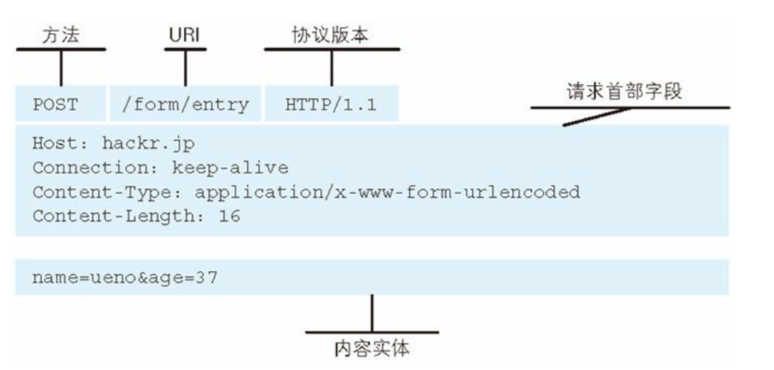

**响应报文的构成**
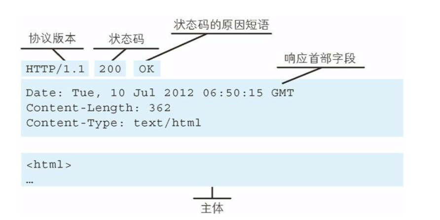

使用HTTP 的方法
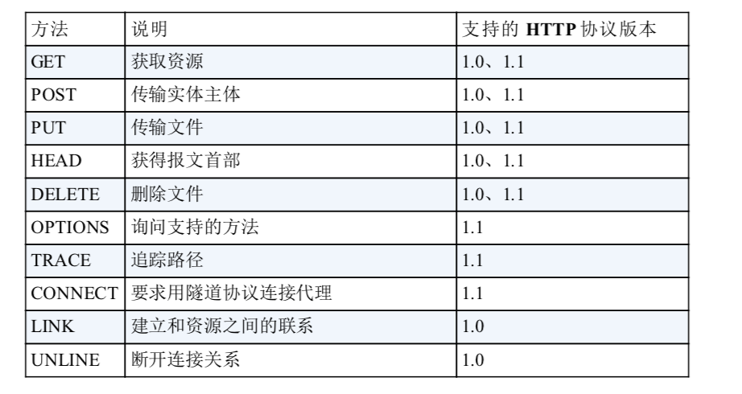

>HTTP会话是持久连接的，特点是：只要任意一段没有明确提出断开连接，则保持TCP连接状态。
>持久连接的好处在与减少了TCP连接的重复建立和断开所造成的额外开销，减轻 服务器端的负载。

### HTTP报文信息
**报文结构**
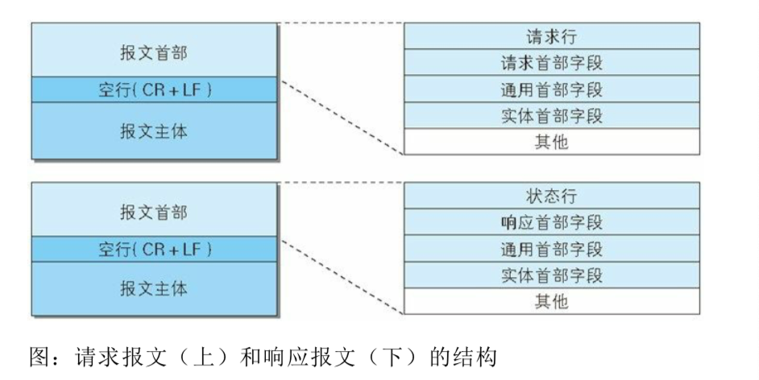

http报文中包含很多信息，例如：用户在网站上下载一个图片或者文件，如果下载过程遇到网络中断，再连接网络后，需要恢复下载，要实现该功能需要指定下载的实体范围，发送一个范围请求（Range Request）

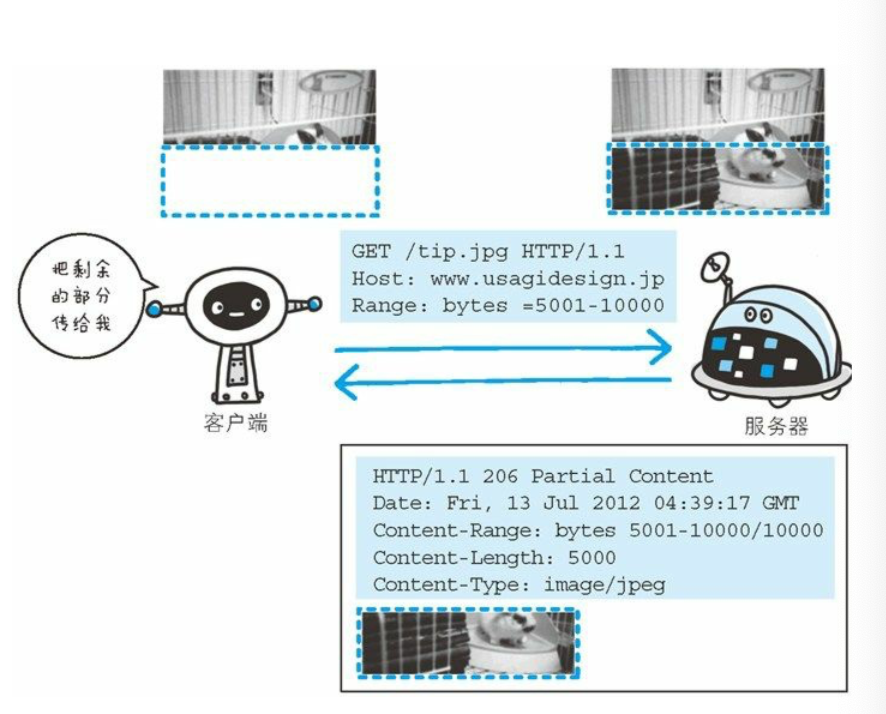

### 返回的HTTP状态码

>HTTP 状态码负责表示客户端HTTP请求的返回结果、标记服务端的处理是否正常、通知出现的错误等工作。

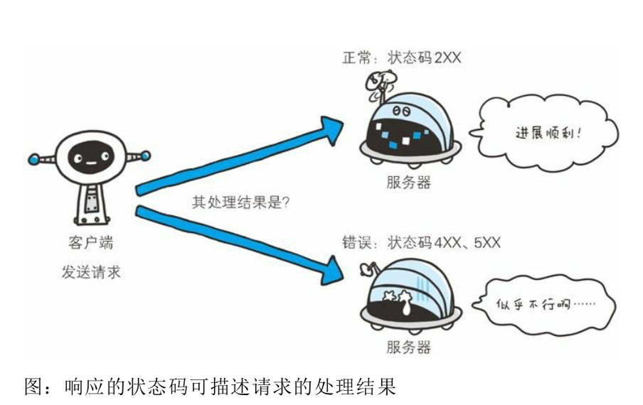

状态码如200OK,以3位数字和原因成。数字中的一位指定了响应别,后两位无分 。
**响应码分别有以下5种**

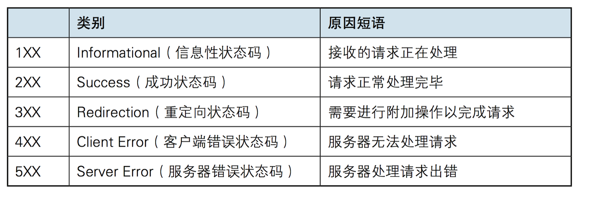

### HTTP 协作的web服务

一台web服务器可搭建多个独立域名的web网站，也可作为通信路径上的中转服务器提升传输效率。

**单台虚拟主机实现多个域名**

利用虚拟主机的功能，即物理层面只有一台服务器，但可以为多为客户服务，每位客户持有的域名运行各自不同的网站。

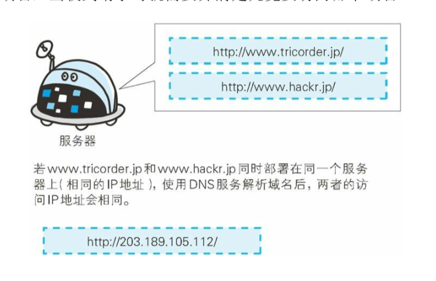

**通信数据转发程序**

代理
>代理是一种有转发功能的应用程序，它扮演了位于服务器和客户端“中间人”的角色，接受由客户端发送的请求并转发给服务器，同时也接受服务器返回的响应并转发给客户端。

网关
>网关是转发其他服务器通信数据的服务器，接收从客户端发送过来的请求时，它好像自己拥有自由的源服务器一样对请求进行处理。

隧道
>隧道是在相隔甚远的客户端和服务器两者之间进行中转，并保持双方通信连接的应用程序。

### 确保web安全的HTTPS

**HTTP的缺点**
- 1、通信使用明文，内容可能会被窃听
- 2、不验证通信方的身份，因此有可能遭遇伪装
- 3、无法证明报文的完整性，所以有可能已遭篡改

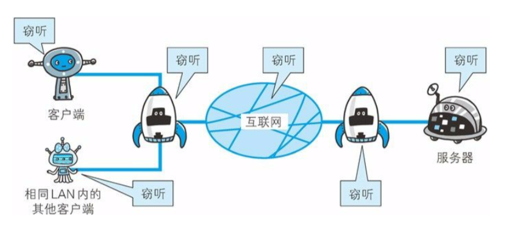

**HTTPS**
>HTTP+加密+认证+完整性保护 = **HTTPS**

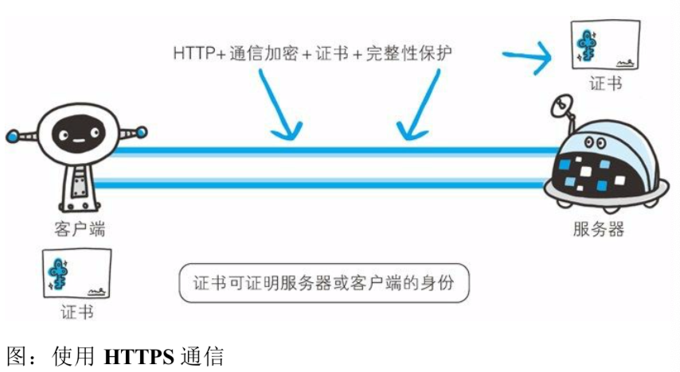

应用场景：
>经常会在web的登录页面和购物结算界面等使用HTTPS通信。使用HTTPS通信时，不再用http://,   而是改用 https:// 。并且，当浏览器访问HTTPS通信有效的web网站时，浏览器的地址栏会出现一个带锁的标记。

**HTTPS是身披SSL外壳的HTTP**
>HTTPS并非是应用层的一种新协议。只是HTTP通信接口部分用**SSL**（Secure Socket Layer） 和 **TLS**（Transport Layer Security ）协议代替而已。

SSL 采用的是一种叫公开密钥加密（Public-key cryptography）

>使用2把密钥的公开密钥加密

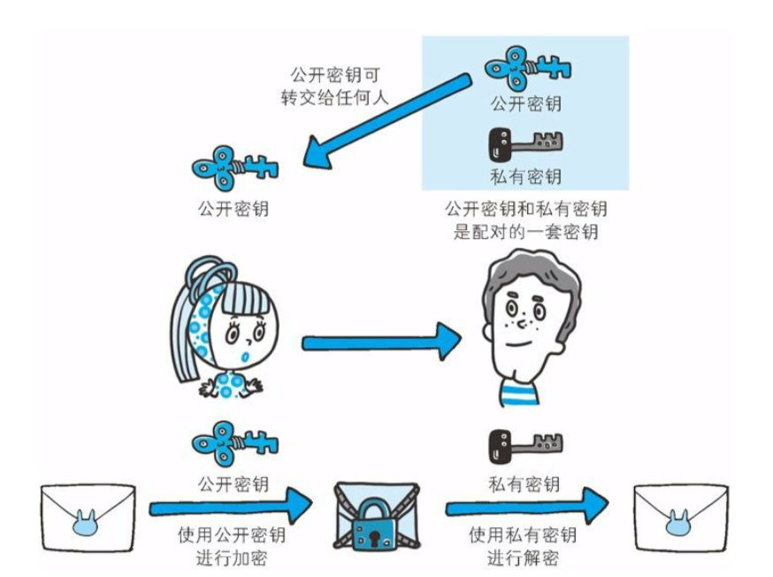

HTTPS采用混合加密机制
>HTTPS采用共享密钥加密和公开密钥加密两者并用的混合加密机制。若密钥能够实现安全交换，那么有可能会考虑仅使用公开密钥加密来通信。

- **公开密钥加密与共享密钥加密相比，处理速度要慢。**
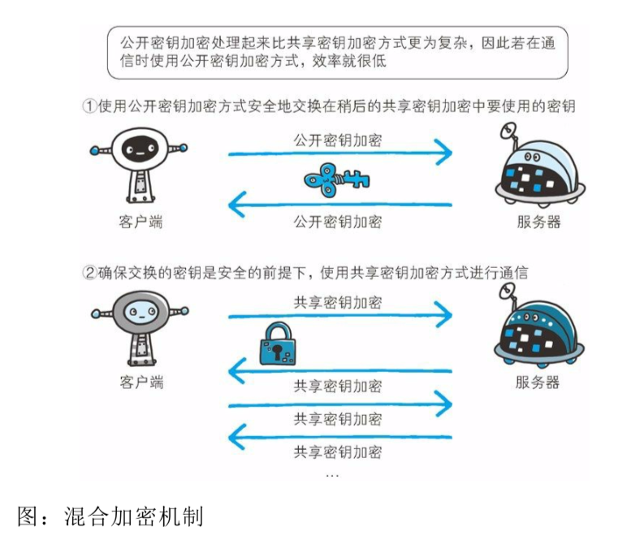

证明公开密钥正确性的证书
>数字证书认证机构处于客户端与服务器双方都信赖的第三方机构的立场上。

**HTTPS比HTTP要慢2到100倍**
SSL的慢分两种
	- 一种是指通信慢
	- 一种是指由于大量消耗CPU及内存等资源导致的处理速度变慢

>和使用HTTP 相比，网络负载可能会变慢2到100倍。除去和TCP连接、发送HTTP请求、响应以外，还必须进行SSL通信，因此整体上处理通信量不可避免会增加。
>另一点是SSL必须进行加密处理。在服务器和客户端都需要进行加密和解密的运算处理。因此从结果上来讲，比起HTTP 会更多的消耗服务器和客户端的硬件资源，导致负载增强。
>针对速度变慢这一问题，并没有根本性的解决方案，我们会使用SSL加速器这种（专用服务器）硬件来改善改问题。

**只对需要信息隐藏的进行加密，以节约资源。**

### web的攻击技术

**两种攻击模式**
主动攻击
- 攻击者直接访问web应用，把攻击代码传入的攻击模式。由于该模式是直接针对服务器上的资源进行攻击，因此攻击者需要能够访问到那些资源。

被动攻击
- 利用**圈套策略**执行攻击代码的攻击模式。在攻击过程中，攻击这不直接对web应用访问发起攻击。

**跨站脚本攻击（Cross-Site Scripting ，XSS）**
>通过存在安全漏洞的web完整注册用户的浏览器内运行非法的HTML标签或JavaScript进行的一种攻击。
>动态创建的HTML 部分有可能隐藏着安全漏洞。

**SQL注入攻击**
>针对web应用使用的数据库，通过运行非法的SQL 而产生的攻击。

**OS命令注入攻击 （OS Command Injection）**
>通过web应用，执行非法的操作命令达到攻击的目的。只要在能调用Shell函数的地方就有存在被攻击的风险。
>OS命令注入攻击可以向Shell发送命令，让Windows或Linux操作系统的命令行启动程序。（也就是说，通过OS注入攻击可执行OS上安装的各种程序。）

**HTTP首部注入攻击**
>攻击者通过在响应首部字段内插入换行，添加任意响应首部或主体的一种攻击。

**邮件首部注入攻击**
>web应用中的邮件发送功能，攻击者通过向邮件首部TO 或 Subject内任意添加非法内容发起的攻击。（利用存在安全漏洞的web网站，可对任意邮件地址发送广告邮件或病毒邮件）

**目录遍历攻击**
>对本无意公开的文件目录，通过非法截断其目录路径后，达成访问目的的一种攻击。（通过web应用对文件处理操作时，在有外部指定文件名的处理存在疏漏的情况下，用户可使用   ../ 等相对路径定位到绝对路径上，因此服务器上任意的文件或文件目录皆有可能被访问到。这样一来，就可以非法浏览、篡改或删去web服务器上的文件 ）

**远程文件包含漏洞**
>当前部分脚本内容需要从其他文件读入时，攻击者可以利用指定外部服务器的URL 充当依赖文件，让脚本读取之后，就可以运行任意脚本的一种攻击。

**安全漏洞**
因设置或设计上的缺陷引发的安全漏洞

- 1、强制浏览：从安置在web服务器的公开目录下的文件中，浏览那些原本非自愿公开的文件。
- 2、不正确的错误消息处理：web应用的错误信息内包含对攻击者有用的信息
- 3、开放重定向：假如指定的重定向URL 到某个具有恶意的web网站（可被攻击者选择用来作为钓鱼攻击的跳板手段）

因会话管理疏忽引发的安全漏洞

- 1、会话劫持：攻击者通过某种手段拿到了用户的会话ID，并非法使用此会话ID伪装成用户，达到攻击目的。
- 2、会话固定攻击：强制用户使用攻击者指定的会话ID。
- 3、跨站点请求伪造（CSRF）：攻击者通过设置好的陷阱，强制对已完成认证的用户进行非预期的个人信息或设定信息等某些状态的更新。

其他安全漏洞
- 1、密码破解攻击：即算出密码，突破认证。攻击不仅限于web应用，还包括其他的系统（如FTP或SSH等）。
- 2、点击劫持：利用透明的按钮或链接做成陷阱，覆盖在web页面上，然后诱使用户在不知情的情况下，点击那个链接访问内容的一种攻击手段（也称页面伪装）
- DoS攻击（Denial of Service attack）：是一种让运行中的服务呈停止状态的攻击。
- 后门程序：指开发设置的隐藏入口，可不按正常步骤使用受限功能。利用后门程序就能够使用原本受限制的功能。