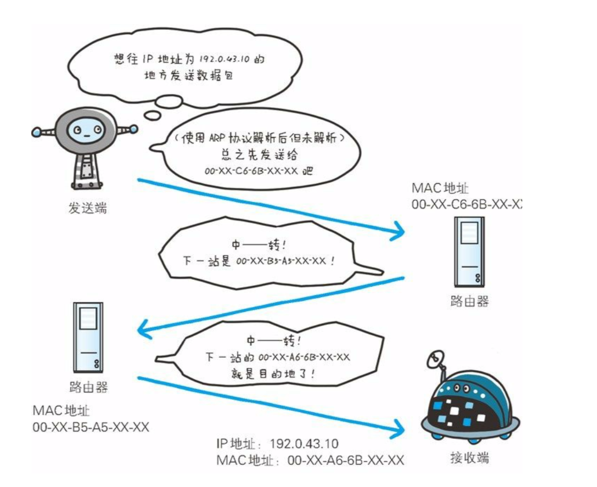

[TOC]

### HTTP 学习
#### 网络基础
>HTTP协议：Hyper Text Transfer Protocol（超文本传输协议）
>**TCP/IP:Transmission Control Protocol/Internet Protocol**(传输控制协议/因特网互联协议)

>万维网：WWW:World Wide Web 

>Web框架：Web framework

应用层
>FTP：File Fransfer Protocol （ 文件传输协议 ）
>DNS：Domain Name System (域名系统）

传输层
>TCP:Transmission Control Protocol（传输控制协议）
>UDP:User Data Protocol (用户数据报协议)

链路层
>NIC:Network Interface Card (网络适配器，即网卡)

**TCP/IP 通信传输过程**

> 发送端在层与层之间传输数据时，每经过一层必定会被打上一个该层所属的首部信息。反之，接收端在层与层传输数据时，每经过一层会把对应的首部消去。

这种把数据信息包装起来的做法叫**封装（encapsulate）**

**IP协议**
IP: Internet Protocl （位于网络层）
>这是说的’IP’不是'IP地址'，而是一中协议的名称。

IP协议的作用是把各种数据包传给对方。
依托两个重要条件：

>IP地址 和 MAC地址（IP地址可变化，MAC 地址基本不会更改）

MAC：Media Access Control Address  

使用ARP协议 凭借MAC地址进行通信
ARP协议：Address Resolution Protocol
>IP间的通信依赖MAC地址。在网络上，通信的双方在同一局域网（LAN）内的情况是很少的，通常是经过多台计算机和网络设备中转来连接对方。
>ARP是一种用于解析地址的协议，根据通信方的IP地址就可以反查出对方对应的MAC地址。

**确保可靠性的TCP协议**
TCP位于传输层，采用三次握手策略。
>用TCP 协议把数据包发送出去后，TCP不会对传送后的情况置之不理，它一定会向对方确认是否成功到达。

DNS：Domain Name System (域名系统)
>DNS 服务是和HTTP 协议一样位于应用层的协议，它提供域名到IP 地址之间的解析服务。

**各种协议与HTTP协议的关系**

URL：UniForm Resource Locator （统一资源定位符）
URI：UniForm Resource Identifier (统一资源标识符)

URI 的格式

#### 简单的HTTP协议

http协议特点
- 基于TCP/IP
>计算机与网络设备要相互通信,双方就必须基于相同的方法。比如,如何探测到通信目标、由哪一边先发起通信、使用哪种语言进行通 信、怎样结束通信等规则都需要事先确定。不同的硬件、操作系统之间 的通信,所有的这一切都需要一种规则。而我们就把这种规则称为协议(protocol)。协议中存在各式各样的内容。从电缆的规格到IP地址的选定方法、 寻找异地用户的方法、双方建立通信的顺序,以及Web页面显示需要 处理的步骤,等等。像这样把与互联网相关联的协议集合起来总称为TCP/IP。而http协议是基于TCP/IP协议之上的应用层协议。

- 基于请求－响应模式
>HTTP协议规定,请求从客户端发出,最后服务器端响应该请求并 返回。换句话说,肯定是先从客户端开始建立通信的,服务器端在没有 接收到请求之前不会发送响应

- 无状态保存
>HTTP是一种不保存状态,即无状态(stateless)协议。HTTP协议 自身不对请求和响应之间的通信状态进行保存。也就是说在HTTP这个 级别,协议对于发送过的请求或响应都不做持久化处理。

- 无连接
>无连接的含义是限制每次连接只处理一个请求。服务器处理完客户的请求，并收到客户的应答后，即断开连接。采用这种方式可以节省传输时间。

**请求报文的构成**

**响应报文的构成**

使用HTTP 的方法

